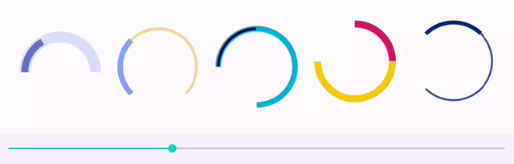

ArcProgressView
===============

[](https://developer.android.com)
[](https://kotlinlang.org)
[](LICENSE)
[](https://apilevels.com)
[](https://jitpack.io/#tonycode/ArcProgressView)

Android ui-component that display progress as an Arc




## Gradle

```kotlin
repositories {
    //...
    maven("https://jitpack.io")
}
```

```kotlin
dependencies {
    //...
    implementation("com.github.tonycode:ArcProgressView:0.1.0")
}
```


## ArcProgressView

```xml
<dev.tonycode.views.ArcProgressView
    android:id="@+id/arcProgressView1"
    android:layout_width="300dp"
    android:layout_height="300dp"
    app:apv_startAngle="-180"
    app:apv_sweepAngle="180"
    app:apv_trackWidth="16dp"
    app:apv_trackColor="#dbdffd"
    app:apv_progress="0.5"
    app:apv_progressWidth="12dp"
    app:apv_progressColor="#646fd4"
    />
```

```kotlin
// configure programmatically
vb.arcProgressView1.apply {
    startAngle = -180f
    sweepAngle = 180f
    trackWidth = 16.dp
    trackColor = 0xFFDBDFFD.toInt()
    progress = 0.5f
    progressWidth = 12.dp
    progressColor = 0xFF646FD4.toInt()
}
```


## License

[MIT](LICENSE)
