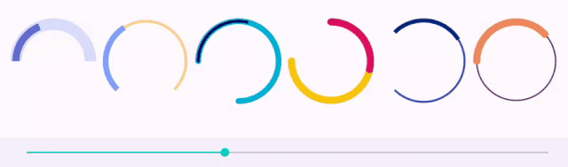

ArcProgressView
===============

[](https://developer.android.com)
[](https://kotlinlang.org)
[](LICENSE)
[](https://apilevels.com)
[](https://jitpack.io/#tonycode/ArcProgressView)

Android ui-component that displays progress as an Arc




## Gradle

```kotlin
repositories {
    //...
    maven("https://jitpack.io")
}
```

```kotlin
dependencies {
    //...
    implementation("com.github.tonycode:ArcProgressView:0.1.1")
}
```


## ArcProgressView

Consists of:
- a track
- a progress that occupy none / a part of track / full track (according to 0% .. 100%)

```xml
<dev.tonycode.views.ArcProgressView
    android:id="@+id/arcProgressView1"
    android:layout_width="300dp"
    android:layout_height="300dp"
    app:apv_startAngle="-180"
    app:apv_sweepAngle="180"
    app:apv_trackWidth="16dp"
    app:apv_trackColor="#dbdffd"
    app:apv_progress="0.5"
    app:apv_progressWidth="12dp"
    app:apv_progressColor="#646fd4"
    app:apv_roundCorners="false"
    />
```

```kotlin
// configure programmatically
vb.arcProgressView1.apply {
    startAngle = -180f
    sweepAngle = 180f
    trackWidth = 16.dp
    trackColor = 0xFFDBDFFD.toInt()
    progress = 0.5f
    progressWidth = 12.dp
    progressColor = 0xFF646FD4.toInt()
    roundCorners = false
}
```

| xml-attribute       | property        | description                                                                                                                    |    default value    |
|:--------------------|:----------------|:-------------------------------------------------------------------------------------------------------------------------------|:-------------------:|
| `apv_startAngle`    | `startAngle`    | The start angle for both track and progress.<br/>uom: degrees (-360..360). Zero value corresponds to 3 o'clock.                | `-180` (9 o'clock)  |
| `apv_sweepAngle`    | `sweepAngle`    | The track's end. Progress will be adjusted to the length of track, 100% will be "occupy full track".<br/>uom: degrees (0..360) | `180` (half circle) |
| `apv_trackWidth`    | `trackWidth`    |                                                                                                                                |       `8.px`        |
| `apv_trackColor`    | `trackColor`    |                                                                                                                                |      `#3f51b5`      |
| `apv_progress`      | `progress`      | from `0f` (0%) to `1f` (100%)                                                                                                  |         `0`         |
| `apv_progressWidth` | `progressWidth` |                                                                                                                                |       `16.px`       |
| `apv_progressColor` | `progressColor` |                                                                                                                                |      `#002984`      |
| `apv_roundCorners`  | `roundCorners`  | Whether the corners of track and progress lines are round or not                                                               |       `true`        |


## License

[MIT](LICENSE)
